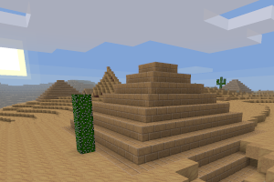

# minetest-mod-tsm_pyramids

BUILDINGS of pyramids with treasures!

## Information

Constructions of pyramids with treasures! You can find them in deserts and sandstone deserts.

This is a mod for Minetest Game which adds randomly spawned pyramids in deserts and
sandstone deserts. The pyramids are very rare and contain chests with stuff.
Also there are mummies inside, which attack the player if found in their radius.

## Technical info

This mod must be named `tsm_pyramids` and is a forked improved version of wuzzy one, 
that is a fork of the old `pyramids` mod by BlockMen and intended to be a direct
(but unofficial) successor of it.

We recommended to use the modernized `pyramids` mod at minenux or oldcoder continuation, 
due to the low availability of the developer to solve problems and his inclination towards 
the obsolescence of minetests and does not help to solve any problem. This mod fork 
is fully compatible with any engine version from 0.4.16 to 5.9.0 version.

The mod will override the default chest and this fork specially will refill the chests 
at every pyramid created. Each pyramid will have a special mob named mummy, and the blocks 
used in the pyramids are only few used (those with pictures).

The mod will register alias if the older mod "pyramid" is detected.

The mod provides a command, `spawnpyramid` will created a new pyramid and it receives 
an optional argumwent as room type, there are 3 rooms types. Such command requirest 
the server privilegie to use it.

## Licensing

This program is free software. It comes without any warranty, to
the extent permitted by applicable law.

* Source code and textures
    * [MIT License](https://mit-license.org/)
    * (c) Copyright BlockMen (2013)
* Mummy model
    * MIT License
    * (c) Copyright Pavel\_S (2013)
* Textures
    * `tsm_pyramids_eye.png` by bas080, [CC-BY-SA 3.0](https://creativecommons.org/licenses/by-sa/3.0/)
    * `tsm_pyramids_men.png` by bas080, CC-BY-SA 3.0
    * `tsm_pyramids_sun.png` by bas080, CC-BY-SA 3.0
* Sounds from ([freesound.org](https://freesound.org)):
    * `mummy.1.ogg` by Raventhornn, [CC0](https://creativecommons.org/publicdomain/zero/1.0/)
    * `mummy.2.ogg` by Raventhornn, CC0
    * `mummy_hurt.1.ogg` by Under7dude, CC0
    * `mummy_death.1.ogg` by scorpion67890 (modified by Wuzzy), CC0
* All other: BlockMen (MIT License)
